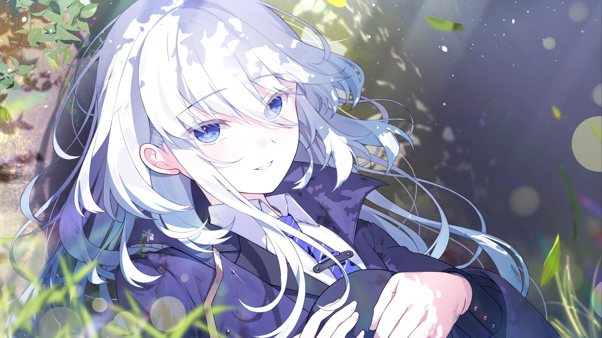
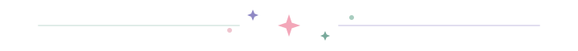

<div align="center">
  

  <h1>Hi, I'm Ancuo Loewe ✦</h1>

  

  <p><strong>黑客也是创作者，与画家、建筑师、作家一样。</strong></p>

  <p>
    <a href="https://github.com/bluedinosaur233?tab=repositories"></a>
    
    
  </p>

  
</div>

## 🌸 About Me

Hi, I'm **Ancuo Loewe**, a builder who learns by making things.

I'm currently exploring **AI Agents and full-stack development** while strengthening my computer science fundamentals. I enjoy turning ideas into clear, reliable tools that people can actually use.

> 🌱 Current quest:  Learn how to build an agent<br>
> 🪄 Favorite challenge: Turn daily issues into simple, useful tools<br>
> ✨ Learning loop: Build small · Verify often · Keep learning

## 🎐 Character Card

```yaml
name: Ancuo Loewe
class: Beginner / Learner
current_quest: AI-powered personal tools
interests:
  - AI Agents
  - Full-stack development
  - Computer science fundamentals
motto: "Never give up on your dreams."
```

## 🪄 Tech Spellbook

<p align="center">
  
  
  
  
  
  <br>
  
  
  
  
  
</p>

<div align="center">
  
  <p>
    <i>日复一日，必有精进</i><br>
    <sub>Thanks for visiting · See you around</sub>
  </p>
</div>
