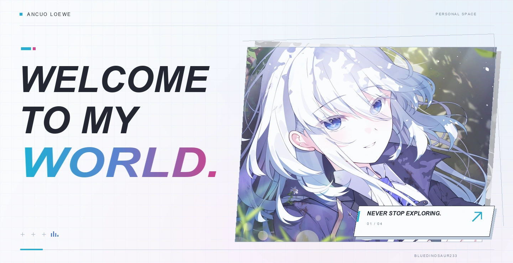
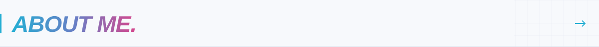
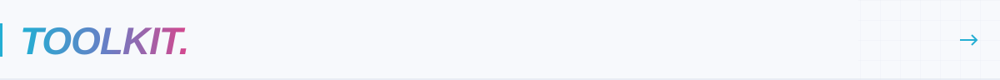
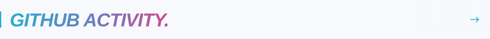

<picture>
  <source media="(max-width: 600px) and (prefers-reduced-motion: reduce)" srcset="./assets/profile-v2/hero-mobile.png">
  <source media="(max-width: 600px)" srcset="./assets/profile-v2/hero-mobile.webp" type="image/webp">
  <source media="(prefers-reduced-motion: reduce)" srcset="./assets/profile-v2/hero.png">
  
</picture>

  
  &nbsp;
  

<picture>
  <source media="(max-width: 600px) and (prefers-reduced-motion: reduce)" srcset="./assets/profile-v2/poem-mobile-static.svg">
  <source media="(max-width: 600px)" srcset="./assets/profile-v2/poem-mobile.svg">
  <source media="(prefers-reduced-motion: reduce)" srcset="./assets/profile-v2/poem-static.svg">
  
</picture>

 

<picture>
  <source media="(max-width: 600px)" srcset="./assets/profile-v2/heading-about-mobile.svg">
  
</picture>

### Hi, I'm Ancuo Loewe.

I'm exploring **AI Agents and full-stack development**.

 

<picture>
  <source media="(max-width: 600px)" srcset="./assets/profile-v2/heading-toolkit-mobile.svg">
  
</picture>

  
  
  
  
  

  
  
  
  
  

 

<picture>
  <source media="(max-width: 600px)" srcset="./assets/profile-v2/heading-activity-mobile.svg">
  
</picture>

<a href="https://github.com/bluedinosaur233?tab=overview">
  <picture>
    <source media="(max-width: 600px) and (prefers-reduced-motion: reduce)" srcset="./assets/profile-v2/activity-mobile-static.svg">
    <source media="(max-width: 600px)" srcset="./assets/profile-v2/activity-mobile.svg">
    <source media="(prefers-reduced-motion: reduce)" srcset="./assets/profile-v2/activity-static.svg">
    
  </picture>
</a>
